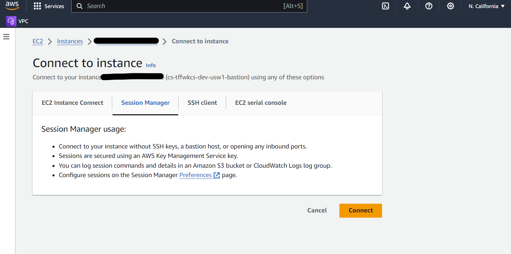

# EC2 Bastion Host

`NOTE: This currently only works for RDP on Windows instances and additional charges will apply. This module should be updated to support SSH connections on Linux hosts.`

Deploy an EC2 bastion host to act as a secure 'jump server' or gateway, enabling administrators to access and manage AWS resources within the same private subnet and VPC. Its primary role is to provide a secure entry point for reaching internal servers and resources directly from the Internet. This bastion host should be employed as a temporary mechanism for accessing private AWS networks until more permanent solutions like VPNs or other recommended access methods are established.

When this resource is no longer needed, it should be destroyed.

## Connect

When using a public IP, one can connect using the standard SSH command over the public interner. However, that's not best-practice. Configure the instance with public IPs disabled `var.ec2_ip_public_auto = false` and specify a private IP `var.ec2_ip_private = "xxx.xxx.xx.xx` in the range for the selected `var.subnet_ids` range. Once the instance is running connect using the web version of SSM Session Manager or via the Session Manager command line.

### Session Manager: Web Terminal Access

1. `Select` the `check box` next to the `EC2 instance` in the EC2 web console.
2. `Click` the `Connect` button.
3. `Select` the `Session Manager` tab for `Terminal access`.
4. `Click` the `Connect` button.
5. 



## Session Manager: RDP

1. `Install` the [Session Manager Plugin](https://docs.aws.amazon.com/systems-manager/latest/userguide/session-manager-working-with-install-plugin.html) for the AWS CLI.
2. `Navigate` to the `Session Manager` console.
3.  `Select` the `Session Management` option under `Node Management` in the left-hand navigation.
4.  `Click` the orange `Start Session` button.
5.  `Type` the description `Create RDP User` under `Reason for session`.
6.  `Select` the `EC2 bastion host` instance under the Target instances section.
7.  `Click` the `Start Session` button.
8.  The web console should appear where the following commands should be entered:
9.  `$Password = Read-Host -AsSecureString` (prompt to enter a secure password).
10. `New-LocalUser "BastionAdmin" -Password $Password` (create a local user).
11. `Add-LocalGroupMember -Group "Remote Desktop Users" -Member "BastionAdmin"` (add user to Remote Desktop Users group).
12. Type `exit` or `click` the `Terminate` button to exit the session.
13. Locally, `run` the command `aws ssm start-session --target BASTION_EC2_INSTANCE_ID --document-name     AWS-StartPortForwardingSession --parameters "localPortNumber=55678,portNumber=3389"` after changing `BASTION_EC2_INSTANCE_ID` the the correct value.
14. `Open` the local `RDP Client`.
15. `Enter` the `localhost:55678` value under the `Computer` input field.
16. `Enter` the `BastionAdmin` value under the `User name` input field.
17. `Click` the `Connect` button.
18. `Enter` the `password` when prompted.

## Debug

```
│ Error: error collecting instance settings: couldn't find resource
│ 
│   with aws_instance.ec2_instance,
```

The AMI is probably invalid, but enable TRACE to confirm when running apply using `TF_LOG=TRACE terraform apply`. See https://github.com/localstack/localstack/issues/6062 for more information.

## Further Reading

There is a good article written about how to do this from scratch by [Kunal Namdev on Medium](https://medium.com/globant/secure-rdp-to-ec2-private-instance-using-aws-ssm-d0a1cadd9d6).

### Linux SSH Connections

https://docs.aws.amazon.com/systems-manager/latest/userguide/session-manager-getting-started-enable-ssh-connections.html

## Usage

All values with the comment `#CHANGE` must be updated based on the AWS account, region, and networking resources.

```
module "bastion" {
  source = "github.com/clearscale/tf-aws-network-ec2-bastion?ref=v1.0.0"

  account = {
    id = "*", name = "dev", provider = "aws", key = "current", region = "us-west-1"
  }

  prefix             = "cs"
  client             = "ClearScale"
  project            = "pmod"
  env                = "dev"
  region             = "us-west-1"             # CHANGE
  name               = "bastion"
  az                 = "AZ_FOR_SUBNET"         # CHANGE BASED ON SUBNET ID AND REGION
  vpc_id             = "VPC_ID"                # CHANGE
  subnet_ids         = ["SUBNET_ID"]           # CHANGE
  ec2_ami            = "ami-0aec1cbfa00609468" # CHANGE: Windows Server AMI
  ec2_start          = true
  ec2_key            = ""
  ec2_key_name       = "SSH_KEY_NAME"          # CHANGE
  ec2_type           = "t3.nano"
  ec2_ip_private     = "10.21.16.4"            # CHANGE BASED ON SUBNET
  ec2_ip_public_auto = false
  ec2_script         = null
}
```

<!-- BEGIN_TF_DOCS -->
## Requirements

| Name | Version |
|------|---------|
| <a name="requirement_terraform"></a> [terraform](#requirement\_terraform) | >= 1.5.6 |

## Providers

| Name | Version |
|------|---------|
| <a name="provider_aws"></a> [aws](#provider\_aws) | 5.45.0 |

## Modules

| Name | Source | Version |
|------|--------|---------|
| <a name="module_std"></a> [std](#module\_std) | github.com/clearscale/tf-standards.git | v1.0.0 |

## Resources

| Name | Type |
|------|------|
| [aws_ebs_volume.this](https://registry.terraform.io/providers/hashicorp/aws/latest/docs/resources/ebs_volume) | resource |
| [aws_ec2_instance_state.this](https://registry.terraform.io/providers/hashicorp/aws/latest/docs/resources/ec2_instance_state) | resource |
| [aws_iam_instance_profile.this](https://registry.terraform.io/providers/hashicorp/aws/latest/docs/resources/iam_instance_profile) | resource |
| [aws_iam_role.ssm_fleet_manager](https://registry.terraform.io/providers/hashicorp/aws/latest/docs/resources/iam_role) | resource |
| [aws_iam_role.this](https://registry.terraform.io/providers/hashicorp/aws/latest/docs/resources/iam_role) | resource |
| [aws_iam_role_policy.this](https://registry.terraform.io/providers/hashicorp/aws/latest/docs/resources/iam_role_policy) | resource |
| [aws_instance.this](https://registry.terraform.io/providers/hashicorp/aws/latest/docs/resources/instance) | resource |
| [aws_network_interface.this](https://registry.terraform.io/providers/hashicorp/aws/latest/docs/resources/network_interface) | resource |
| [aws_security_group.this](https://registry.terraform.io/providers/hashicorp/aws/latest/docs/resources/security_group) | resource |
| [aws_volume_attachment.this](https://registry.terraform.io/providers/hashicorp/aws/latest/docs/resources/volume_attachment) | resource |
| [aws_caller_identity.this](https://registry.terraform.io/providers/hashicorp/aws/latest/docs/data-sources/caller_identity) | data source |
| [aws_partition.this](https://registry.terraform.io/providers/hashicorp/aws/latest/docs/data-sources/partition) | data source |

## Inputs

| Name | Description | Type | Default | Required |
|------|-------------|------|---------|:--------:|
| <a name="input_account"></a> [account](#input\_account) | (Optional). Current cloud provider account info. | <pre>object({<br>    key      = optional(string, "current")<br>    provider = optional(string, "aws")<br>    id       = optional(string, "*") <br>    name     = string<br>    region   = optional(string, null)<br>  })</pre> | <pre>{<br>  "id": "*",<br>  "name": "shared"<br>}</pre> | no |
| <a name="input_arn_partition"></a> [arn\_partition](#input\_arn\_partition) | (Optional). Override the partition to specify in the ARN (aws or aws-us-gov). | `string` | `null` | no |
| <a name="input_az"></a> [az](#input\_az) | (Required). Availability zone. | `string` | n/a | yes |
| <a name="input_client"></a> [client](#input\_client) | (Optional). Name of the client | `string` | `"ClearScale"` | no |
| <a name="input_ec2_ami"></a> [ec2\_ami](#input\_ec2\_ami) | (Optional). Amazon image ID for the EC2 instance. The images needs to have the SSM agent pre-installed. | `string` | `"ami-0aec1cbfa00609468"` | no |
| <a name="input_ec2_ingress"></a> [ec2\_ingress](#input\_ec2\_ingress) | (Optional). Security groups ingress rules. | <pre>list(object({<br>    description     = string<br>    from_port       = number<br>    to_port         = number<br>    protocol        = string<br>    cidr_blocks     = list(string)<br>    security_groups = list(string)<br>  }))</pre> | `null` | no |
| <a name="input_ec2_ip_private"></a> [ec2\_ip\_private](#input\_ec2\_ip\_private) | (Optional). Static private IP address. | `string` | `null` | no |
| <a name="input_ec2_ip_public_auto"></a> [ec2\_ip\_public\_auto](#input\_ec2\_ip\_public\_auto) | (Optional). Auto-assign a public IP address? Cannot be true if var.ec2\_ip\_private is set. | `bool` | `false` | no |
| <a name="input_ec2_key"></a> [ec2\_key](#input\_ec2\_key) | (Optional). Secrets manager variable name of where the SSH key is stored. If not set, pass the SSH key name to var.ec2\_key\_name. | `string` | `""` | no |
| <a name="input_ec2_key_name"></a> [ec2\_key\_name](#input\_ec2\_key\_name) | (Required). SSH key pair for accessing the EC2 instance. | `string` | n/a | yes |
| <a name="input_ec2_script"></a> [ec2\_script](#input\_ec2\_script) | (Optional). User data script to execute when creating the instance. | `string` | `null` | no |
| <a name="input_ec2_start"></a> [ec2\_start](#input\_ec2\_start) | (Optional). Start the EC2 instance upon deployment? | `bool` | `true` | no |
| <a name="input_ec2_type"></a> [ec2\_type](#input\_ec2\_type) | (Optional). EC2 instance type. | `string` | `"t3.nano"` | no |
| <a name="input_ec2_vol_root"></a> [ec2\_vol\_root](#input\_ec2\_vol\_root) | (Optional). Root volume configuration | <pre>object({<br>    delete = bool<br>    size   = number<br>    type   = string<br>    iops   = number<br>  })</pre> | <pre>{<br>  "delete": true,<br>  "iops": null,<br>  "size": 50,<br>  "type": "gp3"<br>}</pre> | no |
| <a name="input_ec2_vol_user"></a> [ec2\_vol\_user](#input\_ec2\_vol\_user) | (Optional). User defined EBS volume configuration | <pre>object({<br>    size   = number<br>    type   = string<br>  })</pre> | `null` | no |
| <a name="input_env"></a> [env](#input\_env) | (Optional). Name of the current environment. | `string` | `"dev"` | no |
| <a name="input_name"></a> [name](#input\_name) | (Optional). The name of the resource, application, or service. | `string` | `"bastion"` | no |
| <a name="input_prefix"></a> [prefix](#input\_prefix) | (Optional). Prefix override for all generated naming conventions. | `string` | `"cs"` | no |
| <a name="input_project"></a> [project](#input\_project) | (Optional). Name of the client project. | `string` | `"pmod"` | no |
| <a name="input_region"></a> [region](#input\_region) | (Optional). Name of the region. | `string` | `"us-west-1"` | no |
| <a name="input_subnet_ids"></a> [subnet\_ids](#input\_subnet\_ids) | (Required). The VPC Subnet ids for which the EC2 instance should be associated with. | `list(string)` | n/a | yes |
| <a name="input_vpc_id"></a> [vpc\_id](#input\_vpc\_id) | (Required). The VPC id for which the EC2 instance should be associated with. | `string` | n/a | yes |

## Outputs

| Name | Description |
|------|-------------|
| <a name="output_ec2_id"></a> [ec2\_id](#output\_ec2\_id) | The ID of the EC2 Instance that is created. |
<!-- END_TF_DOCS -->